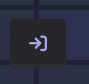
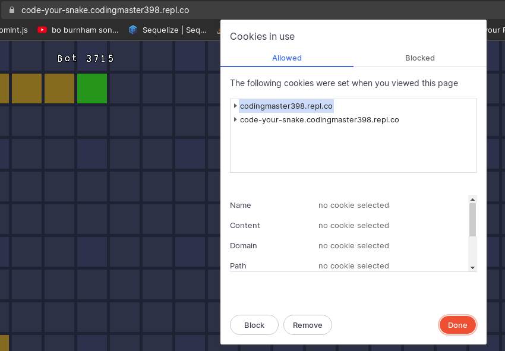
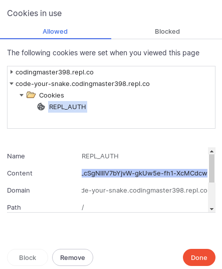

# Code your snake
Welcome to your "Code your snake" client, or bot.

Have a look at [the website](https://code-your-snake.codingmaster398.repl.co/) and keep it open in a new tab.

## What is Code your snake?
Code your snake is an online multiplayer snake game, however, there are no players! You need to code your own snake.

 On [the website](https://code-your-snake.codingmaster398.repl.co/), you can view the rules and spectate the game.

 Here, I'm going to start you off with getting your bot online and giving examples to help you dominate the competition.

## Logging your bot in
Before you start wreaking havoc, we need your snake to log in with your Replit username!

Go to [the website](https://code-your-snake.codingmaster398.repl.co/) and click the button that looks like an arrow pointing to a door (picture below).

A pop-up window will appear asking you to log-in to the site. When you are done, the page should just refresh (that's it).

Click the padlock icon next to the URL and select "cookies". You should see something like this:

Open up `code-your-snake.codingmaster398.repl.co` or whatever server you are on, and copy the `REPL_AUTH` cookie.

*As far as I know, this cookie cannot allow anyone to log in as you from another Replit site or Replit itself, it is unique to Code your snake. This cookie is not kept at replit.com.*

In this Repl, open the secrets tab on the left and make a new cookie called `auth` with the cookie's contents.

## Time to start coding!
Now you've got the login secret, you can login, spawn, and do whatever other bots can do.

Click the run button, and it should say something like this

```
I am at X 58, Y 22
The closest apple is at X 55, Y 26
```
This is the example that is built-in to `index.js`, that logs in, spawns, and sets the snake's direction to up. Looking back at the site, you should see a bot with your Replit username appear and go up. (It might take a while to find in the 150x150 grid!)

You can edit `index.js` to make your bot do a variety of things. Everything handling the connection to the server and built-in functions is in `wrapper.js`, a file you should ignore unless you are experienced in Node.js.

The built-in example has comments outlining what it's doing, so have a go at editing those a bit first before diving in to the ***documentation*** and ***other examples***.

Documentation, outlining what you can do with the bot and how, is in `/learn/docs.md`.

Other examples are in `/learn/examples/`.

**Have fun!**